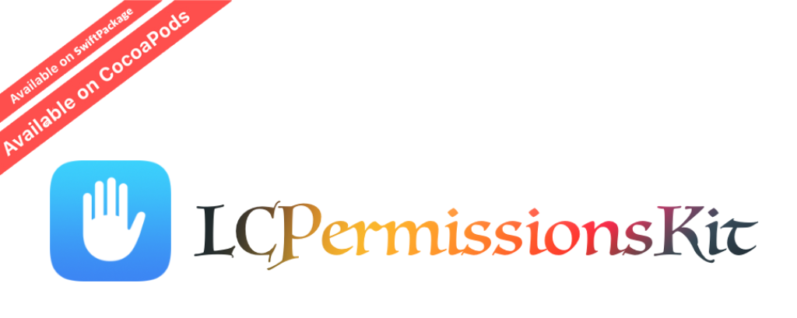

<p align="center">


<p align="center"> <b> LCPermissionsKit is a convenient wrapper on the macOS permissions API, including photos, contacts, reminders, and full disk access permissions</b></p>


<p align="center">


<a href="https://developer.apple.com/swift/"></a>


<a href="https://twitter.com/LiuChuan_"></a>
</p>


Current implementation supports permissions for: 

* [Calendar](#calendar)
* [Contacts](#contacts)
* [Reminders](#reminders)
* [Photos](#photos)
* [Full Disk Access](#full-disk-access)


## Installation

### CocoaPods
PermissionsKit is available through [CocoaPods](https://cocoapods.org). To install it, simply add the following line to your Podfile:

```swift

pod 'LCPermissionsKit'

```

### SwiftPackage


Add `https://github.com/DevLiuSir/LCPermissionsKit` in the [“Swift Package Manager” tab in Xcode](https://developer.apple.com/documentation/xcode/adding_package_dependencies_to_your_app).


### Usage

```swift
 LCPermissionsKit.shared.requestAuthorization(for: .fullDiskAccess) { status in
	print(status)   
}
```


